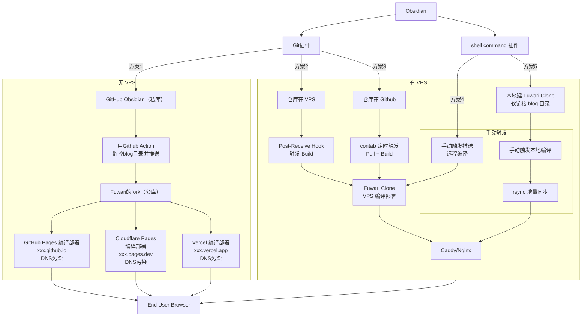

## 前提

Obidian 作为主要笔记仓库，其中建一个目录，里面只存放博客内容。可以通过部署 hexo/astro 等框架编译成静态 html。
 1. 实现和框架解耦，换框架不影响博客文章。
 2. 私库内容完全私有，只有博客目录的内容会被传输到仓库外。
 3. 实现全自动备份，因为文章在 obsidian vault 中，本来也要备份 vault，自动就一起备份了。
 4. 实现全自动发布，写作完成后内容自动编译发布上线。
 
## 方案解析

|      | 全自动 | 配置难度     | 发布速度     | 无须开发环境 | 支持手机发布 | 可直连 |
| ---- | --- | -------- | -------- | ------ | ------ | --- |
| 方案 1 | ✅   | ⭐️       | ⭐️       | ✅      | ✅      | ❌   |
| 方案 2 | ✅   | ⭐️⭐️     | ⭐️⭐️⭐️   | ✅      | ✅      | ❌   |
| 方案 3 | ✅   | ⭐️⭐️     | ⭐️⭐️⭐️   | ✅      | ✅      | ❌   |
| 方案 4 | ❌   | ⭐️⭐️⭐️   | ⭐️⭐️⭐️   | ✅      | ❌      | ✅   |
| 方案 5 | ❌   | ⭐️⭐️⭐️⭐️ | ⭐️⭐️⭐️⭐️ | ❌      | ❌      | ✅   |

我一共折腾了 8 种部署方式，全部都能跑通，最后筛选觉得这 5 种还比较不错。（目前自己用方案 2）
白嫖 CF R2 做图床，插件可自动替换 URL

## 在 Obsidian 中写作流程

1. 编写 markdown，图片可以直接粘贴进来，图片会暂存在自文件夹的 resource 目录，不用管它，不用上传（可以考虑关闭 git 自动 commit）。
2. CMD+P 执行 `Image Upload Toolkit: Publish Page` 会自动把图片上传 R2，同时更新文章内的链接，但是不会自动删除本地文件。
3. CMD+P 执行 `File Cleaner Dux: Clean files` , 因为 resource 下粘贴的文件不再被任何文件引用，用这个插件自动清理 vault 里的所有图片，节约空间。

## 关键设置


这个设置影响所有的图片路径，图片上传 R2 之后会在 bucket 里面自动建一个 resource 目录，未来所有的链接都会包含 resource，不要轻易改动。

## Templater 插件，推荐但非必要

- 建一个目录放模板
- 新建一个模板笔记：`Blog-Front-Matter`:
```
---
title: Post Front-matter
category:
description: ""
tags:
  - 标签
image: "" 如果有封面图就不能加引号，引号为了避免编译错误
published: <% tp.date.now("YYYY-MM-DDTHH:MM:SS+08:00") %> 
draft: false
---
```
- 配置一个 **folder template**, 指定 blog 目录对应的 template 为 `Blog-Front-Matter`

## Git 插件


## File Cleaner Redux 插件


## Image Upload Toolkit 插件（第三方图床才需要）


### Cloudflare R2 bucket 文档说明
- Enable public access
- Expose your bucket as a custom domain under your control.
- Expose your bucket using a Cloudflare-managed `https://r2.dev` subdomain for non-production use cases.

## Linter 插件，不必须但强烈推荐，优化中英文混排 markdown
- Quote 这个开关和 templater 里面的模板冲突，必须关掉

- 这个必须开启，否则中英文混合的 markdown 排版可能出错


## Shell Command 插件，如果要本地操作上传或编译

- 编译和同步的脚本，前提是 VPS_HOST 已经配置好 `ssh public key` 和 `.ssh/config`
```bash
source ~/.zshrc && \
# 1. 进入工厂目录 lint 一下内容
cd ~/static-blog-source && \
# 2. 彻底清理旧产物并重新编译
pnpm run build && \
# 3. 只有在编译成功(dist/index.html 存在)时才同步到 VPS
[ -f "./dist/index.html" ] && \
rsync -avz --delete ./dist/ VPS_HOST:/var/www/html/blog/

```
- Output - stdout - ignore
- Output - stderr - ask after execution （可以方便的看结果，熟练后无所谓）
