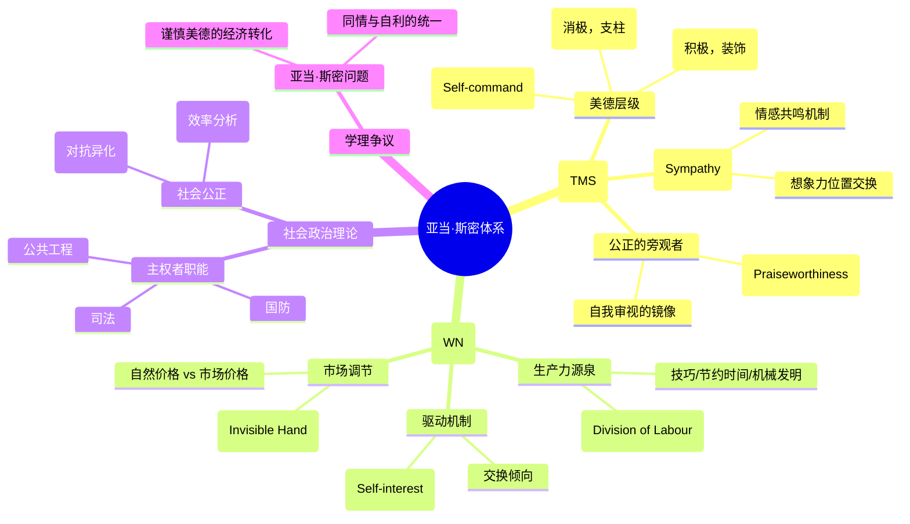

## 1.古典经济学亚当·斯密

亚当·斯密（Adam Smith）作为 18 世纪苏格兰启蒙运动的集大成者，其思想体系不仅构成了现代经济学的基石，更是一部关于人类天性、道德情感、法律制度与物质文明演进的宏大社会哲学。传统的学术分类往往将斯密割裂为 " 伦理学家 " 与 " 经济学家 "，但通过对《道德情操论》（The Theory of Moral Sentiments, 1759）与《国民财富的性质和原因的研究》（An Inquiry into the Nature and Causes of the Wealth of Nations, 1776）的整合性研究，可以发现斯密试图构建的是一个统一的 " 人类科学 " 体系 1。本报告旨在为专业研究者与深度学习者提供一份详尽的、逻辑严密的学术综述，全面剖析斯密的理论核心，并提供系统化的学习路径。

### 第一章 引言：苏格兰启蒙运动中的斯密图景

> [!note]
> **选择题**：亚当·斯密在格拉斯哥大学期间，深受哪位被誉为 " 苏格兰启蒙运动之父 " 的学者影响？
>
> - A. 大卫·休谟 (David Hume)
> - B. 弗朗西斯·哈奇森 (Francis Hutcheson)
> - C. 约翰·洛克 (John Locke)
> - D. 魁奈 (François Quesnay)

亚当·斯密于 1723 年出生于苏格兰克科迪，其一生跨越了工业革命的前夜。在格拉斯哥大学，他师从 " 苏格兰启蒙运动之父 " 弗朗西斯·哈奇森（Francis Hutcheson），并在这里确立了对道德哲学的终身兴趣 4。斯密的学术生涯并非起始于经济数据，而是起始于对人类同情心的观察。他曾任格拉斯哥大学道德哲学讲座教授，讲授逻辑学、修辞学、法学和政治经济学 2。

斯密的理论并非孤立产生，它深受大卫·休谟（David Hume）经验主义哲学的影响，同时也作为对当时盛行的重商主义（Mercantilism）政策的系统性反击 6。重商主义认为国家的财富取决于金银的积累和贸易顺差，而斯密则提出，国民财富的真正源泉是国民的劳动及其生产率的提升 9。这种范式的转移不仅是经济学的胜利，更是自然自由体系（System of Natural Liberty）在社会管理层面的全面铺开。

> [!info]
> B

### **第二章 《道德情操论》：人类道德判官的起源**

> [!note]
> **问答题**：请简述斯密理论中 " 公正的旁观者 " ( *The Impartial Spectator* ) 的定义及其在个体道德判断中的功能。

[《道德情操论》](https://www.gutenberg.org/ebooks/67363)（The Theory of Moral Sentiments 以下简称 TMS）是斯密引以为傲的首部巨著。在这部著作中，斯密探讨了人类如何从天生的自利倾向中产生出社会共识与道德约束 5。

#### 2.1 同情：道德情感的基石

斯密认为，" 同情 "（Sympathy）并非指简单的可怜或怜悯，而是指 " 对他人任何激情的同感 " 1。由于人类无法直接感受他人的感官经验，必须借由想象力（Imagination）进行 " 位置交换 "，从而产生对他人的理解。

**原文精读（关于同情的本质）：**

 "How selfish soever man may be supposed, there are evidently some principles in his nature, which interest him in the fortune of others, and render their happiness necessary to him, though he derives nothing from it except the pleasure of seeing it. Of this kind is pity or compassion, the emotion which we feel for the misery of others, when we either see it, or are made to conceive it in a very lively manner…. As we have no immediate experience of what other men feel, we can form no idea of the manner in which they are affected, but by conceiving what we ourselves should feel in the like situation."

" 无论一个人被认为怎样自私，他的天性中显然存在着一些原则，使他关注他人的命运，并将他人的快乐视作对他自己是必要的，尽管他除了看到这种快乐而感到满足外，从中得不到任何其他好处。这种原则就是怜悯或同情……当我们看到他人的痛苦时，我们由于看到或生动地感知到这种痛苦而产生的感触。……因为我们没有关于他人感觉方式的直接经验，我们无法对他人所感受到的东西形成任何观念，除非通过设想我们在同样的情况下会感受到什么。"

这段话揭示了斯密道德哲学的实证主义色彩：道德并非来自上帝的律令，而是来自人类心理结构的必然反应。这种 " 心理镜像 " 机制使得人们在社会互动中不断调整自己的行为，以追求与他人的 " 情感共鸣 " 14。

> [!NOTE] Leo 笔记
> 祖先无法分辨食物是否有毒，某地是否安全，某个野兽是否打得过，需要能够快速的模仿和学习，这种模仿和学习能力可能源自，或造就了这种 " 同理心 "

#### 2.2 公正的旁观者：内化的镜子

斯密理论中最具原创性的概念是 " 公正的旁观者 "（The Impartial Spectator）。他认为，我们评价他人行为时相对容易，但评价自己时却受激情干扰。因此，人类在社会交往中逐渐在内心塑造了一个虚构的、公正的第三方。

| 角色         | 定义与功能                       | 心理机制            |
| :--------- | :-------------------------- | :-------------- |
| **当事人**    | 行为的发出者，受直接情感和利益驱动。          | 寻求同情与认可。        |
| **实际旁观者**  | 社会中的他人，观察者的反应构成 " 外部评判 "。   | 通过社会反馈提供评价。     |
| **公正的旁观者** | 内化的道德准则，代表 " 内心之子 " 或上帝的代理。 | 想象自己处于中立立场进行审视。 |

**原文精读（关于公正的旁观者）：**

"We can never survey them our *own sentiments and motives*, we can never form any judgment concerning them; unless we remove ourselves, as it were, from our own natural station, and endeavour to view them as at a certain distance from us. But we can do this in no other manner than by endeavouring to view them with the eyes of other people, or as other people are likely to view them…. We must view them, neither from our own place nor yet from his, but from the place and with the eyes of a *third person*, who has no particular connection with either, and who judges with impartiality between us…. When I endeavour to examine my own conduct, when I endeavour to pass sentence upon it, and either to approve or condemn it, it is evident that, in all such cases, I divide myself, as it were, into two persons; and that I, the examiner and judge, represent a character different from that other I, the person whose conduct is examined into."

" 我们只有离开自己的自然立场，并试图从一定的距离外来看待这些动机和情感，才能对它们进行任何考察，才能形成任何判断。……我们必须既不从自己的眼光看，也不从对方的眼光看，而是从一个与我们双方都没有特殊关系、在两者之间进行公正判断的第三人的立场和眼光来看。……每当我们试图检查自己的行为时，每当我们试图对其通过判决并赞同或谴责它时，显然在所有这些情况下，我们仿佛把自己分成了两个人；我这个检查者和评判者，表现出与另一个我——那个行为被检查的人——不同的性格。"

这种 " 自我分裂 " 是人类道德成熟的标志。公正的旁观者不仅考虑社会的赞扬，更考虑 " 值得赞扬 "（Praiseworthiness）。正如研究指出，它是人类道德自我修养的规范性指南。

#### 2.3 正义与仁慈：社会的支柱

斯密将美德分为不同层次。他指出，*正义是 " 负向的美德 "*，即不伤害他人；而*仁慈是 " 正向的美德 "*，即增进他人的福利。

| 美德类型                 | 强制性             | 社会功能            | 违反后果        |
| :------------------- | :-------------- | :-------------- | :---------- |
| **正义 (Justice)**     | 极强，可由法律强制执行。    | 社会大厦的支柱，防止社会崩溃。 | 招致愤恨与惩罚。    |
| **仁慈 (Beneficence)** | 较弱，无法强制，属于劝诫性质。 | 社会大厦的装饰，使生活更美好。 | 仅招致不悦或不以为然。 |

斯密深刻地写道，即使没有仁慈，社会仍能通过功利主义的交换维持下去；但如果没有正义，社会将不可避免地崩解 。("Society may subsist among different men, as among different merchants, from a sense of its utility, without any mutual love or affection; and though no man in it should owe any obligation, or be bound in gratitude to any other, it may still be upheld by a mercenary exchange of good offices according to an agreed valuation…. But Justice, on the contrary, is the main pillar that upholds the whole edifice. If it is removed, the great, the immense fabric of human society, must in a moment crumble into atoms.")

> [!NOTE]
> 在审视自己时，人想象出另一个自我，站在非自我的立场看待自我的行为，从而获得更加公正的判断

### 第三章 《国富论》：国民财富的逻辑

> [!question]
> **问答题**：请简述斯密理论中 " 公正的旁观者 " ( *The Impartial Spectator* ) 的定义及其在个体道德判断中的功能。

[《国富论》](https://www.gutenberg.org/ebooks/3300)（以下简称 WN）于 1776 年出版，标志着古典政治经济学的诞生。斯密在本书中探讨了财富增长的机制，即生产力如何通过分工与积累得到提升 。

#### 3.1 分工：效率的革命

WN 的第一章开宗明义地讨论了分工。斯密认为，劳动生产力的最大提升源于分工。

**原文精读（扣针工厂的著名例子）：**

> "A workman not educated to this business (which the division of labour has rendered a distinct trade), nor acquainted with the use of the machinery employed in it (to the invention of which the same division of labour has probably given occasion), could scarce, perhaps, with his utmost industry, make one pin in a day, and certainly could not make twenty. But in the way in which this business is now carried on, not only the whole work is a peculiar trade, but it is divided into a number of branches, of which the greater part are likewise peculiar trades. One man draws out the wire, another straights it, a third cuts it, a fourth points it, a fifth grinds it at the top for receiving the head; to make the head requires two or three distinct operations; to put it on, is a peculiar business, to whiten the pins is another… I have seen a small manufactory of this kind where ten men only were employed, and where some of them consequently performed two or three distinct operations. But though they were very poor… they could, when they exerted themselves, make among them about twelve pounds of pins in a day. There are in a pound upwards of four thousand pins of a middling size. Those ten persons, therefore, could make among them upwards of forty-eight thousand pins in a day."
> " 一个劳动者，如果不曾受过扣针制造业（分工的结果使这种职业成为一种专门的职业）的训练，又不熟悉这种职业所使用的机械（分工的结果也许才发明出这些机械），那么，纵使竭力工作，也许一天连一枚扣针也造不出来，更不用说造出二十枚了。但按照现在这种经营方法，这种作业不仅全过程已成为一种专门职业，而且这种职业又分成若干部门……一个人抽铁线，另一个人拉直，第三个人切断，第四个人削尖，第五个人打磨顶端以便装头；制作头部需要有两三种不同的操作；装头也是一种专门业务，涂白扣针又是另一种……我见过一个这种小工厂，一共只雇用十个工人，因此他们中有几个人要兼任两三种操作。尽管他们很穷……但如果他们勤奋努力，一日也能造出约十二磅扣针。一磅中等的扣针，有四千枚以上。这十个工人，每日就可造出四万八千枚以上扣针。"

斯密总结了分工提高产出的三个原因：

1. **技巧的增进**：工人长期专注于单一操作，熟练度大幅提高 24。
2. **时间的节约**：避免了从一种工作转换到另一种工作时常见的 " 磨洋工 " 现象 。
3. **机械的发明**：专注于单一工序的工人（甚至包括普通的半大孩子）往往会发现更便捷的操作方法，从而导致发明 。

#### 3.2 交换倾向与自利：市场的驱动力

斯密提出，分工并非人类智慧预见的产物，而是人类 " 互通有无、物物交换、互相交易 " 这一天性的必然结果 1。这种交换并不依赖于对方的善意，而依赖于对彼此利益的诉求。

**原文精读（关于屠夫、酿酒者与面包师）：**

> "It is not from the benevolence of the butcher, the brewer, or the baker, that we expect our dinner, but from their regard to their own interest. We address ourselves, not to their humanity but to their self-love, and never talk to them of our own necessities but of their advantages. Nobody but a beggar chuses to depend chiefly upon the benevolence of his fellow-citizens. Even a beggar does not depend upon it entirely…. With it he finally catches those ten pounds of pins in a day as others do, by treaty, by barter, and by purchase." (The Wealth of Nations Book I, Chapter II)
> " 我们每天所需的食料，不是出自屠夫、酿酒师或焙制师的恩惠，而是出于他们自利的打算。我们不说唤起他们利他心的话，而说唤起他们利己心的话。我们不说自己有需要，而说对他们有利。除了乞丐，没有一个人愿意全然依仗同胞的恩惠。即便是一个乞丐，也不会完全依赖它。……他最终以此满足了自己的大部分偶然需求，就像其他人一样，通过协议、易货和购买。" 14

这一观点为现代市场经济提供了道德上的辩护：当个体在法律允许的范围内追求自身利益时，他也在客观上服务了社会 6。

#### 3.3 资本积累与财富观的转变

斯密彻底推翻了金银即财富的重商主义信条。他认为，一国的财富在于其人民每年消费的 " 必需品和便利品 (necessaries and conveniences of life)" 的总和 。资本的积累是扩大再生产的前提，而节俭（Frugality）则是资本形成的源泉。他指出，" 每一件浪费都是对公共基金的掠夺 " 。

| 概念 | 重商主义观点 | 亚当·斯密观点 |
| :---- | :---- | :---- |
| **财富定义** | 国库中的金银储备。 | 劳动的年产物，即消费品。 |
| **贸易目的** | 顺差，通过出口换取贵金属。 | 互利，通过交换获得本国不生产的商品。 |
| **政府角色** | 保护、管制、特许经营。 | 国防、司法、公共工程（有限介入）。 |
| **繁荣核心** | 垄断与特许权力。 | 自由竞争与分工。 |

### 第四章 " 看不见的手 "：从隐喻到自发秩序

" 看不见的手 "（Invisible Hand）是斯密流传最广的词汇，但在其两部巨著中各仅出现一次。深入理解这一概念需要结合其具体的论证上下文 。

#### 4.1 TMS 中的分配逻辑

在《道德情操论》中，斯密使用这个隐喻来描述土地所有者。尽管地主心怀贪婪，但其胃纳有限，为了维持庞大的家室和随从，他必须分配生活必需品 。

原文精读（TMS 中的看不见的手）：

> "The rich only select from the heap what is most precious and agreeable. They consume little more than the poor, and in spite of their natural selfishness and rapacity, though they mean only their own conveniency, though the sole end which they propose from the labours of all the thousands whom they employ, be the gratification of their own vain and insatiable desires, they **divide with the poor** the produce of all their improvements. They are led by **an invisible hand** to make nearly the same distribution of the necessaries of life, which would have been made, had the earth been divided into equal portions among all its inhabitants, and thus without intending it, without knowing it, advance the interest of the society, and afford means to the multiplication of the species." (The Theory of Moral Sentiments Part IV, Chapter I)
> " 富人只是从大量产物中选用了最昂贵、最难得的东西。他们消耗得比穷人稍多一些……尽管他们天性自私且贪婪，虽然他们只图自己方便，虽然他们雇佣千百人工作的唯一目的是满足自己虚荣、贪得无厌的欲望，但他们还是与穷人分享他们所有改良成果的产物。他们被一只 ' 看不见的手 ' 引导着，去作出生活必需品的分配，这种分配与在土地平均分配给所有居民的情况下所能达到的分配几乎完全相同；这样，富人就在无意之中，在并不知道的情况下，增进了社会的利益，并为人类繁衍提供了手段。"

#### 4.2 WN 中的资源配置

在《国富论》第四篇，斯密在批评重商主义政策时再次提到这个隐喻。当个体倾向于支持国内产业而非国外产业时，他追求的是自身的安全和利润，却在无形中促进了公共利益 。

**原文精读（WN 中的看不见的手）：**

> "Every individual is continually exerting himself to find out the most advantageous employment for whatever capital he can command. It is his own advantage, indeed, and not that of the society, which he has in view. But the study of his own advantage naturally, or rather necessarily, leads him to prefer that employment which is most advantageous to the society… He generally, indeed, neither intends to promote the public interest, nor knows how much he is promoting it. By preferring the support of domestic to that of foreign industry, he intends only his own security; and by directing that industry in such a manner as its produce may be of the greatest value, he intends only his own gain, and he is in this, as in many other cases, led by **an invisible hand** to promote an end which was no part of his intention." (The Wealth of Nations (Book IV, Chapter II)
> " 每个个体都不断地努力为他所能支配的资本找到最有利的用途。确实，他所考虑的是他自己的利益，而不是社会的利益。但是，对他自身利益的研究自然会引导他倾向于对社会最有利的用途。……他通常既不打算促进公共利益，也不知道他在多大程度上促进了这种利益。由于宁愿投资支持国内产业而不支持国外产业，他只是为了保障他自己的安全；由于监控该产业使其产物具有最大价值，他只是为了获得自己的利润。在这点上，就像在许多其他情况下一样，他被一只 **看不见的手** 引导着，去促进一个他全然无意追求的目的。"

" 看不见的手 " 本质上是 " 社会自发秩序 " 的体现：系统性的良性结果并不一定需要系统性的设计。这一思想在后世被哈耶克（F.A. Hayek）等经济学家进一步发扬光大 。

### 第五章 亚当·斯密问题：同情与自利的辩证统一

19 世纪的德国学者曾提出所谓的 " 亚当·斯密问题 "（Das Adam Smith Problem），认为斯密在《道德情操论》中主张利他主义（同情），而在《国富论》中主张极端利己主义（自利），两者互不相容 。

#### 5.1 知识论的贯通

现代研究普遍认为，这不仅不是一个矛盾，反而是斯密社会科学体系的精妙所在。

1. **自利不等于贪婪**：在 WN 中，斯密所说的 " 自利 "（Self-interest）实际上是 TMS 中提到的 " 谨慎 "（Prudence）美德的体现。谨慎是对自身利益的理性经营，它受到 " 公正的旁观者 " 的约束。
2. **市场作为社会化场所**：斯密认为市场交易不仅仅是冷冰冰的数字交换，它本质上是人与人之间的互惠。正如研究指出，商业社会促使人们学会合作、守信和自我约束，因为这符合长期的利益。
3. **同情的界限**：斯密并不认为人类能对全人类产生等量的爱。在 TMS 中，他指出我们的关心程度随着距离的增加而递减 37。正因为在广大的社会中我们无法依赖每个人的博爱，市场的互利机制才显得尤为重要。

#### 5.2 自利在两书中的不同评价

有趣的是，有学者提出 " 反向斯密问题 "：在 TMS 中，斯密对适度的自利持更肯定的态度，因为它有助于个人的自我保存；而在 WN 中，斯密反而多次猛烈抨击商人和制造业者的 " 贪婪 " 和 " 垄断精神 "，认为他们的利益往往与公众利益背道而驰。

" 同一行业的人很少聚会，哪怕是为了娱乐或消遣，但只要聚在一起，他们的谈话往往不是以某种针对公众的阴谋告终，就是以某种提高价格的策划告终。"

这证明斯密并非资本家的盲目吹鼓手，他真正拥护的是竞争性市场，而非特定的阶级利益。

### 第六章 制度、政治与社会正义

斯密的理论带有强烈的经验历史主义色彩。他在 WN 的第五篇详细讨论了主权者（国家）的职责。

#### 6.1 主权者的三项基本职责

斯密坚决反对政府干预微观经济，但他为国家保留了三项神圣不可侵犯的职能：

| 职责名称                    | 内容描述                     | 斯密论点依据            |
| :---------------------- | :----------------------- | :---------------- |
| **国防 (Defense)**        | 保护社会不受其他独立社会的暴力和侵略。      | 必须通过职业军队来实现。      |
| **司法 (Justice)**        | 保护社会各成员不受其他成员的欺凌或压迫。     | 建立一个准确的司法行政体系。    |
| **公共工程 (Public Works)** | 建立并维持那些对社会有大利、但对个人无利的设施。 | 如道路、桥梁、运河及公共教育机构。 |

#### 6.2 劳动异化与公共教育

斯密在分工理论中展现了惊人的洞察力，他预见到了工业化对人类心智的潜在伤害。他认为，长期从事单调、机械劳动的工人工人会变得 " 愚蠢和无知 "。

**原文精读（关于分工的代价与教育）：**

> " 一个人如果把自己的一生都花在执行几个简单的操作上，而这些操作的结果也许总是相同的，或者非常相似，那么他便没有机会发挥他的理解力或行使他的发明力……他自然会失去这种努力的习惯，一般会变得尽可能地愚蠢和无知。……他的心智的麻木，不仅使他不能欣赏或参与任何理性的对话，而且不能感受任何慷慨、高尚或温柔的情感，从而也就不能对私人生活的许多普通责任形成任何公正的判断。……为了防止这种几乎必然产生的堕落，国家必须对普通大众的教育付出很大努力，尤其是在那个阶层的人民，他们的孩子在能够工作时便被迫去工作的情况下。"

斯密因此主张国家应建立廉价的、甚至强制性的基础教育系统。这不仅是为了提高生产力，更是为了维护公民的尊严和政治稳定。

#### 6.3 反对奴隶制的经济分析

斯密对奴隶制持强烈的道德反感，但他深知仅靠道德说教难以打动奴隶主。在 WN 中，他从效率角度进行了批判。

**原文精读（奴隶劳动的低效）：**

> " 所有时代和所有国家的经验都证明，我认为，由自由人完成的工作最终比由奴隶完成的工作更便宜。……一个不能获取任何财产的人，除了尽可能多吃、尽可能少劳动外，不会有任何其他兴趣。他所做的超过其维持生计所必需的工作，只能通过暴力挤压出来，而不是通过他自身的任何兴趣。……在古意大利，谷物种植退化了多少，对主人来说变得多么无利可图，当它落入奴隶管理之下时，普林尼和科鲁迈拉都有记载。"

斯密精准地指出，奴隶主之所以维持奴隶制，往往不是为了利润（因为自由劳动更便宜），而是为了满足人类那邪恶的 " 统治欲 " 和 " 支配欲 "。

### 第七章 亚当·斯密在中国的传播与译介

亚当·斯密思想进入中国是现代中国思想史上的里程碑。1901-1902 年，严复翻译的《原富》（WN）在上海出版，这标志着西方古典经济学系统进入中国 52。

#### **7.1 严复的《原富》与跨文化对接**

严复在翻译时面临着巨大的术语挑战。例如，如何翻译 "Interest"？在中国传统儒家文化中，" 利 " 往往与 " 义 " 对立 53。

1. **书名取意**：严复将书名译为《原富》，意为 " 探究财富之源 " 53。
2. **义利之辨**：严复在按语中试图通过斯密的理论证明，个人的求利行为如果受到法律（斯密所谓正义）的约束，不仅不损人利己，反而是国家富强的基础。他提出了 " 合群 " 与 " 自营 " 的平衡 53。
3. **影响**：严复的译本采用典雅的古文，使当时的士大夫阶层开始接触并接受 " 市场、分工、自由竞争 " 等现代观念。2001 年，中国学术界举行了《原富》出版百周年纪念，强调其对中国向市场经济转型的重要性 52。

#### **7.2 核心概念的中外对应**

| 亚当·斯密核心概念 | 严复及当代译名 | 理论内涵 |
| :---- | :---- | :---- |
| **Sympathy** | 同情 / 恕 / 感通 | 道德判断的情感共鸣基础。 |
| **Division of Labour** | 分工 / 计工分事 | 提高生产力的核心手段。 |
| **Invisible Hand** | 不可见之手 / 冥冥之柄 | 市场自发调节秩序的隐喻。 |
| **Laissez-faire** | 放任 / 自由放任 / 听其自然 | 政府对经济活动的非干预政策。 |
| **Natural Liberty** | 自然自由 / 天赋自由 | 每个人在正义法则下追求利益的权利。 |

### 第八章 深度学习路径：2-3 小时精进指南

为了让读者在两到三小时内建立起对斯密体系的深度理解，本报告建议采取 " 文本互文 " 学习法。

#### 第一阶段：道德心理学实验（45 分钟）

- **任务**：阅读 TMS 第一卷第一章关于 " 同情 " 的论述，尝试在现实生活中寻找 " 位置交换 " 的案例 13。
- **核心思考**：为什么斯密说即使是 " 最凶狠的歹徒 " 也不会完全丧失同情心？这种天性如何构成社会秩序的底层逻辑？ 13
- **资源**：[《道德情操论》第一卷第一章原文链接](https://www.gutenberg.org/cache/epub/67363/pg67363-images.html)

#### 第二阶段：扣针工厂与财富之谜（45 分钟）

- **任务**：阅读 WN 第一卷前两章。重点关注分工如何改变了人类的生活方式，以及 " 屠夫酿酒师面包师 " 案例中关于说服他人自利心的逻辑 9。
- **核心思考**：为什么在斯密看来，乞丐才是最不自由的人？为什么交换倾向是人类独有的？ 34
- **资源**：[《国富论》第一卷第一章原文链接](https://www.gutenberg.org/files/3300/3300-h/3300-h.htm)

#### 第三阶段：隐喻的真相与批判精神（30 分钟）

- **任务**：对比阅读 TMS 和 WN 中关于 " 看不见的手 " 的两处原文 32。
- **核心思考**：斯密真的认为市场是完美的吗？他在 WN 第五卷中对分工的批评说明了什么？ 30
- **资源**：[《国富论》第四卷第二章原文链接](https://www.adamsmithworks.org/documents/book-iv-chapter-2)

#### 第四阶段：中国视野下的斯密（20 分钟）

- **任务**：阅读严复《原富》的翻译背景及 " 亚当·斯密在中国 " 的学术综述。
- **核心思考**：斯密的理论如何帮助一个传统社会完成向现代契约社会的心理跨越？

### 第九章 核心概念思维导图 (Mermaid)

### 第十章 结语：斯密体系的永恒价值

亚当·斯密不仅揭示了自由市场的效率，更描绘了一个基于个人尊严、正义法治与相互同情的社会愿景。他的伟大之处在于，他既不神话利他主义，也不美化贪婪，而是客观地分析了人类复杂的天性如何被转化为文明的力量。

正如斯密在 TMS 中所写，" 那种在人群中创造情感和激情和谐的完美人性，是由多为他人着想、少为自己着想，克制自私、发挥仁慈构成的 " 15。而在 WN 中，他向我们展示了这种和谐在物质世界的表现：当每个人被允许以自己的方式追求利益而不违反正义时，社会将达到一种 " 普遍的富足 "。对于 21 世纪的读者而言，斯密的著作依然是理解人类合作、经济发展与社会道德互动的必读书。

---

**阅读建议**：在深度学习过程中，建议优先阅读商务印书馆出版、谢宗林或杨敬年翻译的当代版本，并辅以亚当·斯密作品集（Adam Smith Works）提供的在线导读 55，以获得最准确的学理把握。通过这 2-3 小时的沉浸式学习，你将不再仅仅看到一个 " 自由市场的发明者 "，而是一个对人类心智和社会演化有着深刻洞见的伟大哲学家。

#### **Works cited**

1. The Theory of Moral Sentiments \- Wikipedia, accessed March 18, 2026, [https://en.wikipedia.org/wiki/The\_Theory\_of\_Moral\_Sentiments](https://en.wikipedia.org/wiki/The_Theory_of_Moral_Sentiments)
2. Understanding the Misinterpretations & the Fallacy of the Adam Smith Problem \- The Cupola, accessed March 18, 2026, [https://cupola.gettysburg.edu/cgi/viewcontent.cgi?article=1019\&context=ger](https://cupola.gettysburg.edu/cgi/viewcontent.cgi?article=1019&context=ger)
3. Adam Smith's Wealth of Nations: A Reader's Guide, accessed March 18, 2026, [https://api.pageplace.de/preview/DT0400.9781316371411\_A25608966/preview-9781316371411\_A25608966.pdf](https://api.pageplace.de/preview/DT0400.9781316371411_A25608966/preview-9781316371411_A25608966.pdf)
4. Adam Smith \- Project Gutenberg, accessed March 18, 2026, [https://www.gutenberg.org/ebooks/64753.epub.images](https://www.gutenberg.org/ebooks/64753.epub.images)
5. The Theory of Moral Sentiments by Adam Smith | Literature and Writing \- EBSCO, accessed March 18, 2026, [https://www.ebsco.com/research-starters/literature-and-writing/theory-moral-sentiments-adam-smith](https://www.ebsco.com/research-starters/literature-and-writing/theory-moral-sentiments-adam-smith)
6. The Wealth of Nations | Summary, Themes, Significance, & Facts | Britannica, accessed March 18, 2026, [https://www.britannica.com/topic/the-Wealth-of-Nations](https://www.britannica.com/topic/the-Wealth-of-Nations)
7. Excerpt from Adam Smith's ​Wealth of Nations, accessed March 18, 2026, [https://civics.asu.edu/sites/g/files/litvpz456/files/2020-12/Q12%20Excerpt%20from%20Wealth%20of%20Nations\_CPTL.pdf](https://civics.asu.edu/sites/g/files/litvpz456/files/2020-12/Q12%20Excerpt%20from%20Wealth%20of%20Nations_CPTL.pdf)
8. ADAM SMITH, THE WEALTH OF NATIONS (1776): ON CHINA1, accessed March 18, 2026, [https://media.bloomsbury.com/rep/files/primary-source-57-adam-smith-the-wealth-of-nations-on-china.pdf](https://media.bloomsbury.com/rep/files/primary-source-57-adam-smith-the-wealth-of-nations-on-china.pdf)
9. An Inquiry into the Nature and Causes of the Wealth of Nations \- Project Gutenberg, accessed March 18, 2026, [https://www.gutenberg.org/files/3300/3300-h/3300-h.htm](https://www.gutenberg.org/files/3300/3300-h/3300-h.htm)
10. Sample text for The wealth of nations / Adam Smith ; introduction by Robert Reich \- The Library of Congress, accessed March 18, 2026, [https://catdir.loc.gov/catdir/samples/random042/00064573.html](https://catdir.loc.gov/catdir/samples/random042/00064573.html)
11. The Wealth of Nations by Adam Smith | Summary & Analysis \- Lesson \- Study.com, accessed March 18, 2026, [https://study.com/academy/lesson/adam-smiths-the-wealth-of-nations-summary-lesson-quiz.html](https://study.com/academy/lesson/adam-smiths-the-wealth-of-nations-summary-lesson-quiz.html)
12. The Theory of Moral Sentiments by Adam Smith | Project Gutenberg, accessed March 18, 2026, [http://www.gutenberg.org/ebooks/67363](http://www.gutenberg.org/ebooks/67363)
13. The Theory of Moral Sentiments Or, an Essay Towards an Analysis of the Principles by Which Men Naturally Judge Concerning the Conduct and Character, First of Their Neighbours, and Afterwards of Themselves. to Which Is Added, a Dissertation on the Origin of Languages. \- Project Gutenberg, accessed March 18, 2026, [https://www.gutenberg.org/cache/epub/67363/pg67363-images.html](https://www.gutenberg.org/cache/epub/67363/pg67363-images.html)
14. 'The Adam Smith Problem' and Adam Smith's Utopia \- doğan göçmen, accessed March 18, 2026, [https://dogangocmen.wordpress.com/wp-content/uploads/2012/12/the-adam-smith-problem-and-adam-smiths-utopia5.pdf](https://dogangocmen.wordpress.com/wp-content/uploads/2012/12/the-adam-smith-problem-and-adam-smiths-utopia5.pdf)
15. Adam Smith theoretical question : r/EconomicHistory \- Reddit, accessed March 18, 2026, [https://www.reddit.com/r/EconomicHistory/comments/l8zqp5/adam\_smith\_theoretical\_question/](https://www.reddit.com/r/EconomicHistory/comments/l8zqp5/adam_smith_theoretical_question/)
16. The Impartial Spectator, accessed March 18, 2026, [http://web.stanford.edu/class/history34q/readings/VirtualWitnessDiscussion/SmithImpartialSpectator.html](http://web.stanford.edu/class/history34q/readings/VirtualWitnessDiscussion/SmithImpartialSpectator.html)
17. The Impartial Spectator: Adam Smith's Construct For a Perspective For Objective Morality, accessed March 18, 2026, [https://steemit.com/psychology/@jokerpravis/the-impartial-spectator-adam-smith-s-construct-for-a-perspective-for-objective-morality](https://steemit.com/psychology/@jokerpravis/the-impartial-spectator-adam-smith-s-construct-for-a-perspective-for-objective-morality)
18. TMS Reading Guide: Part III | Adam Smith Works, accessed March 18, 2026, [https://www.adamsmithworks.org/documents/tms-reading-guide-part-iii-section-i](https://www.adamsmithworks.org/documents/tms-reading-guide-part-iii-section-i)
19. Adam Smith's The Theory of Moral Sentiments: A Critical Commentary \- ResearchGate, accessed March 18, 2026, [https://www.researchgate.net/publication/354024643\_Adam\_Smith's\_The\_Theory\_of\_Moral\_Sentiments\_A\_Critical\_Commentary](https://www.researchgate.net/publication/354024643_Adam_Smith's_The_Theory_of_Moral_Sentiments_A_Critical_Commentary)
20. Adam Smith's Essays on Philosophical Subjects: MORAL SENTIMENTS; ASTRONOMICAL INQUIRIES; FORMATION OF LANGUAGES \- Project Gutenberg, accessed March 18, 2026, [https://www.gutenberg.org/cache/epub/58559/pg58559-images.html](https://www.gutenberg.org/cache/epub/58559/pg58559-images.html)
21. 亚当•斯密 \- 商务印书馆, accessed March 18, 2026, [https://www.cp.com.cn/book/search.dhtml?renwu=%E4%BA%9A%E5%BD%93%E2%80%A2%E6%96%AF%E5%AF%86](https://www.cp.com.cn/book/search.dhtml?renwu=%E4%BA%9A%E5%BD%93%E2%80%A2%E6%96%AF%E5%AF%86)
22. 道德情操论 Audiobook \- Libro.fm, accessed March 18, 2026, [https://libro.fm/audiobooks/9798868753183-](https://libro.fm/audiobooks/9798868753183-)
23. An Inquiry into the Nature and Causes of the Wealth of Nations by Adam Smith, accessed March 18, 2026, [http://www.gutenberg.org/ebooks/3300](http://www.gutenberg.org/ebooks/3300)
24. On the Causes of Improvement in the Productive Powers. On Labour, and on the Order According to Which its' Produce is Naturally Distributed Among the Different Ranks of the People., accessed March 18, 2026, [https://www.marxists.org/reference/archive/smith-adam/works/wealth-of-nations/book01/ch01.htm](https://www.marxists.org/reference/archive/smith-adam/works/wealth-of-nations/book01/ch01.htm)
25. Quote by Adam Smith: "To take an example, therefore, from a very trif…" \- Goodreads, accessed March 18, 2026, [https://www.goodreads.com/quotes/870206-to-take-an-example-therefore-from-a-very-trifling-manufacture](https://www.goodreads.com/quotes/870206-to-take-an-example-therefore-from-a-very-trifling-manufacture)
26. 1.9: Adam Smith — Excerpts from The Wealth of Nations, 1776 \- Social Sci LibreTexts, accessed March 18, 2026, [https://socialsci.libretexts.org/Courses/Western\_Washington\_University/Introduction\_to\_Political\_Theory\_I/01%3A\_Readings/1.09%3A\_Adam\_Smith\_\_Excerpts\_from\_The\_Wealth\_of\_Nations\_1776](https://socialsci.libretexts.org/Courses/Western_Washington_University/Introduction_to_Political_Theory_I/01%3A_Readings/1.09%3A_Adam_Smith__Excerpts_from_The_Wealth_of_Nations_1776)
27. Smith \- History Department, accessed March 18, 2026, [https://history.hanover.edu/courses/excerpts/111smith.html](https://history.hanover.edu/courses/excerpts/111smith.html)
28. Chapter I | Adam Smith Works, accessed March 18, 2026, [https://www.adamsmithworks.org/documents/chapter-1-of-the-division-of-labour](https://www.adamsmithworks.org/documents/chapter-1-of-the-division-of-labour)
29. The Wealth Of Nations Pdf \- Wax Studios, accessed March 18, 2026, [https://wax-studios.com/Fulldisplay/GKpWGn/443202/Thewealthofnationspdf.pdf](https://wax-studios.com/Fulldisplay/GKpWGn/443202/Thewealthofnationspdf.pdf)
30. Adam Smith and the Division of Labor \- Digital Commons @ Trinity, accessed March 18, 2026, [https://digitalcommons.trinity.edu/cgi/viewcontent.cgi?article=1079\&context=econ\_faculty](https://digitalcommons.trinity.edu/cgi/viewcontent.cgi?article=1079&context=econ_faculty)
31. Adam Smith and the Poor | Acton Institute, accessed March 18, 2026, [https://www.acton.org/religion-liberty/volume-33-number-4/adam-smith-and-poor](https://www.acton.org/religion-liberty/volume-33-number-4/adam-smith-and-poor)
32. Adam Smith's Invisible Hand | Adam Smith Works, accessed March 18, 2026, [https://www.adamsmithworks.org/documents/adam-smith-peter-foster-invisible-hand](https://www.adamsmithworks.org/documents/adam-smith-peter-foster-invisible-hand)
33. ECN 222\. Principles of Economics \- Macro, accessed March 18, 2026, [http://www.appstate.edu/\~whiteheadjc/eco2030/mankiw/lastday.htm](http://www.appstate.edu/~whiteheadjc/eco2030/mankiw/lastday.htm)
34. Adam Smith on the Butcher, the Brewer, and the Baker | Online Library of Liberty, accessed March 18, 2026, [https://oll.libertyfund.org/quotes/adam-smith-butcher-brewer-baker](https://oll.libertyfund.org/quotes/adam-smith-butcher-brewer-baker)
35. Adam Smith (1776), The wealth of nations "Die Unsichtbare Hand des Marktes" \- Uni Ulm, accessed March 18, 2026, [https://www.uni-ulm.de/fileadmin/website\_uni\_ulm/mawi.inst.150/lehre/ws0910/GVWL/AdamSmith.pdf](https://www.uni-ulm.de/fileadmin/website_uni_ulm/mawi.inst.150/lehre/ws0910/GVWL/AdamSmith.pdf)
36. Adam Smith | Lesson Plan, accessed March 18, 2026, [https://assets.ctfassets.net/qnesrjodfi80/5FUIMoSq8pz6nQIur0lnF0/800ef9ecc8376c7fbb582986cb493f87/Adam\_Smith\_\_\_Lesson\_Plan.pdf](https://assets.ctfassets.net/qnesrjodfi80/5FUIMoSq8pz6nQIur0lnF0/800ef9ecc8376c7fbb582986cb493f87/Adam_Smith___Lesson_Plan.pdf)
37. Extracts from Adam Smith \- Andrew Roberts, accessed March 18, 2026, [http://studymore.org.uk/xsmith.htm](http://studymore.org.uk/xsmith.htm)
38. Invisible Hand Toolkit | Adam Smith Works, accessed March 18, 2026, [https://www.adamsmithworks.org/documents/invisible-hand-toolkit](https://www.adamsmithworks.org/documents/invisible-hand-toolkit)
39. Adam Smith & Invisible Hand | PDF | The Wealth Of Nations | Friedrich Hayek \- Scribd, accessed March 18, 2026, [https://www.scribd.com/document/167832286/Adam-Smith-Invisible-Hand](https://www.scribd.com/document/167832286/Adam-Smith-Invisible-Hand)
40. Book IV, Chapter 2 | Adam Smith Works, accessed March 18, 2026, [https://www.adamsmithworks.org/documents/book-iv-chapter-2](https://www.adamsmithworks.org/documents/book-iv-chapter-2)
41. "The Adam Smith Problem in Reverse: Self-Interest in Adam Smith's Wealth of Nations and Theory of Moral Sentiments" History of Political Economy. 2008\. 40.2: 365-382. \- Academia.edu, accessed March 18, 2026, [https://www.academia.edu/328385/\_The\_Adam\_Smith\_Problem\_in\_Reverse\_Self\_Interest\_in\_Adam\_Smith\_s\_Wealth\_of\_Nations\_and\_Theory\_of\_Moral\_Sentiments\_History\_of\_Political\_Economy\_2008\_40\_2\_365\_382](https://www.academia.edu/328385/_The_Adam_Smith_Problem_in_Reverse_Self_Interest_in_Adam_Smith_s_Wealth_of_Nations_and_Theory_of_Moral_Sentiments_History_of_Political_Economy_2008_40_2_365_382)
42. The Adam Smith Problem in Reverse: Self-Interest in The Wealth of Nations and The Theory of Moral Sentiments \- ResearchGate, accessed March 18, 2026, [https://www.researchgate.net/publication/31123637\_The\_Adam\_Smith\_Problem\_in\_Reverse\_Self-Interest\_in\_The\_Wealth\_of\_Nations\_and\_The\_Theory\_of\_Moral\_Sentiments](https://www.researchgate.net/publication/31123637_The_Adam_Smith_Problem_in_Reverse_Self-Interest_in_The_Wealth_of_Nations_and_The_Theory_of_Moral_Sentiments)
43. TMS Reading Guide: Part VI | Adam Smith Works, accessed March 18, 2026, [https://www.adamsmithworks.org/documents/tms-reading-guide-part-vi](https://www.adamsmithworks.org/documents/tms-reading-guide-part-vi)
44. The Theory of Moral Sentiments Summary and Study Guide | SuperSummary, accessed March 18, 2026, [https://www.supersummary.com/the-theory-of-moral-sentiments/summary/](https://www.supersummary.com/the-theory-of-moral-sentiments/summary/)
45. The Profound Wisdom—And Humanitarianism—Of Adam Smith \- Hoover Institution, accessed March 18, 2026, [https://www.hoover.org/research/profound-wisdom-and-humanitarianism-adam-smith](https://www.hoover.org/research/profound-wisdom-and-humanitarianism-adam-smith)
46. Adam Smith Quotes & FAQs: Insights into the Mind of a Visionary | PanmureHouse.org, accessed March 18, 2026, [https://www.panmurehouse.org/adam-smith/smith-quotes-faqs/](https://www.panmurehouse.org/adam-smith/smith-quotes-faqs/)
47. Adam Smith on Education: Schooling, accessed March 18, 2026, [https://www.adamsmithworks.org/documents/adam-smith-on-education-schooling](https://www.adamsmithworks.org/documents/adam-smith-on-education-schooling)
48. ADAM SMITH, THE WEALTH OF NATIONS (1776): ON SLAVERY1 \- Bloomsbury Publishing, accessed March 18, 2026, [http://media.bloomsbury.com/rep/files/primary-source-144-adam-smith-the-wealth-of-nations-on-slavery.pdf](http://media.bloomsbury.com/rep/files/primary-source-144-adam-smith-the-wealth-of-nations-on-slavery.pdf)
49. Adam Smith on Slavery, accessed March 18, 2026, [https://www.adamsmithworks.org/documents/adam-smith-on-slavery](https://www.adamsmithworks.org/documents/adam-smith-on-slavery)
50. Adam Smith on Slavery | Online Library of Liberty, accessed March 18, 2026, [https://oll.libertyfund.org/quotes/adam-smith-on-slavery](https://oll.libertyfund.org/quotes/adam-smith-on-slavery)
51. Adam Smith on Those Who Wish to Dominate Others \- Conversable Economist, accessed March 18, 2026, [https://conversableeconomist.com/2025/03/06/adam-smith-on-those-who-wish-to-dominate-others/](https://conversableeconomist.com/2025/03/06/adam-smith-on-those-who-wish-to-dominate-others/)
52. Adam Smith in China \- A Critical Bibliography of Adam Smith \- Cambridge University Press & Assessment, accessed March 18, 2026, [https://www.cambridge.org/core/books/critical-bibliography-of-adam-smith/adam-smith-in-china/9EF420ADB535273413195C6FC0764993](https://www.cambridge.org/core/books/critical-bibliography-of-adam-smith/adam-smith-in-china/9EF420ADB535273413195C6FC0764993)
53. Adam Smith in Imperial China: Translation and Cultural Adaptation \- OpenEdition Journals, accessed March 18, 2026, [https://journals.openedition.org/oeconomia/1167?lang=en](https://journals.openedition.org/oeconomia/1167?lang=en)
54. Adam Smith in China \- Cambridge Core \- Journals & Books Online, accessed March 18, 2026, [https://resolve.cambridge.org/core/services/aop-cambridge-core/content/view/9EF420ADB535273413195C6FC0764993/9781851965373c10\_p209-218\_CBO.pdf/adam-smith-in-china.pdf](https://resolve.cambridge.org/core/services/aop-cambridge-core/content/view/9EF420ADB535273413195C6FC0764993/9781851965373c10_p209-218_CBO.pdf/adam-smith-in-china.pdf)
55. Reading Guides | Adam Smith Works, accessed March 18, 2026, [https://www.adamsmithworks.org/documents/reading-guides](https://www.adamsmithworks.org/documents/reading-guides)
