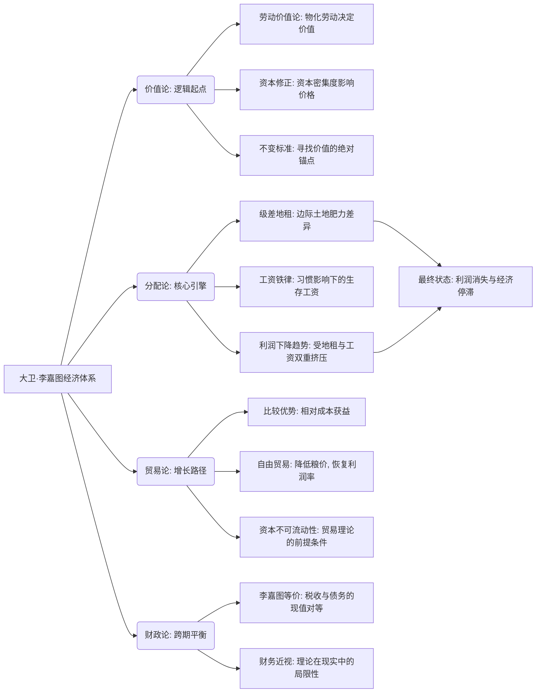
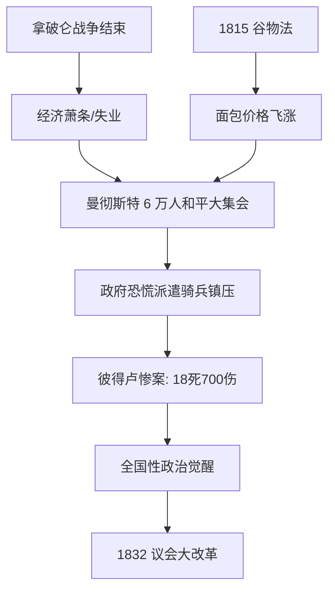

# 大卫·李嘉图经济理论体系的演绎重构与分配法则

> [!Question]
> **问题 1**：李嘉图将政治经济学的核心使命从亚当·斯密关注的「财富总量增长」转向了什么领域？

# 导言：从斯密的秩序到李嘉图的法则

大卫·李嘉图（David Ricardo）在 1817 年出版的《政治经济学及赋税原理》（On the Principles of Political Economy and Taxation）不仅是古典政治经济学的巅峰之作，更是现代经济分析范式的真正起源。如果说亚当·斯密（Adam Smith）是在工业革命的晨曦中描绘了一幅关于国民财富增长的宏大叙事画卷，那么李嘉图则是以一位证券经纪人特有的冷峻和严密的逻辑，将这幅画卷拆解为由劳动价值论、边际收益递减规律以及比较优势原理构成的数理模型 。李嘉图的研究重心发生了根本性的位移：他不再仅仅关注财富的总量，而是将“确立调节社会三大阶级——地主、资本家和劳动者——之间分配的规律”视为政治经济学的核心使命 。这种从生产向分配的转向，深刻地揭示了资本主义早期工业化过程中的阶级矛盾与增长瓶颈。

在拿破仑战争背景下，英国面临着高昂的谷物价格和日益沉重的国家债务，李嘉图通过其独特的抽象演绎法，为当时的 [《谷物法》](#^e10096) 争论提供了理论武装。他认为，土地肥力的有限性与人口增长的无限性之间存在不可调和的冲突，这种冲突最终会导致利润率的下降和经济的停滞 。本报告将系统性地重构李嘉图的理论大厦，从价值论的基石出发，历经分配论的博弈，最终落脚于国际贸易的自由化理想。

# 第一章 价值理论的逻辑严密化：对斯密的批判与继承

> [!Question]
> **问题 2**：根据李嘉图的价值理论，对于绝大多数可以通过人类劳动大规模复制的可再生商品，其交换价值主要由什么决定？

## 1.1 使用价值、交换价值与劳动的核心地位

李嘉图在理论构建的开端便展现出对逻辑一致性的近乎偏执的追求。他接受了斯密关于使用价值和交换价值的区分，并引用了著名的“水与钻石”悖论：水具有极大的效用但交换价值极低，而钻石虽无甚用处却价值连城 。然而，李嘉图进一步指出，虽然效用是交换价值的必要前提（如果一种商品完全无用，无论生产它需要多少劳动，它都不会有价值），但它绝非交换价值的衡量尺度 。

李嘉图将商品严格划分为两类，这种分类方法体现了他对市场供求力量与生产成本关系的深刻理解。第一类是数量无法增加的商品，如名画、古钱币或珍稀葡萄酒，其价值完全取决于稀缺性及富人的购买意愿；第二类则是绝大多数可以通过人类劳动大规模复制的工业品和农产品，其价值主要由生产过程中耗费的劳动量决定 。

|**商品类别**|**价值决定因素**|**规模效应**|
|---|---|---|
|非再生商品 (Non-reproducible)|绝对稀缺性 (Scarcity)|供给曲线完全无弹性|
|可再生商品 (Reproducible)|必要劳动时间 (Labor Time)|供给可随需求无限扩展|

## 1.2 劳动价值论的修正：资本密集度与时间价值

李嘉图对政治经济学最大的逻辑贡献在于他坚持了“物化劳动”而非“购买劳动”作为价值尺度的原则。斯密在讨论资本积累后的社会时，错误地认为价值是由工资、利润和地租相加而成的“成本”，这在李嘉图看来是一种循环论证，因为工资本身也是需要被解释的价格 。

然而，李嘉图并未盲目坚持纯粹的劳动价值论。他意识到，当不同行业使用的固定资本与流动资本比例不同，或者固定资本的耐用性存在差异时，相对价格会偏离相对劳动投入量 。例如，如果由于工资上涨导致所有劳动密集型产品的成本大幅上升，而资本密集型行业因为使用了大量机器，其受工资变动的影响相对较小，这会导致两者之间的交换比例发生变化，即便其生产所需的总劳动量并未改变 。

这种对“时间”和“资本构成”的关注，使得李嘉图的理论被称为“93% 的劳动价值论”，他承认利息或平均利润的补偿是对长期资本占用的必然要求，尽管他始终在寻找一种“不变的价值标准”（Invariable Standard of Value），试图在分配变量波动时捕捉到真实的价值锚点 。

# 第二章 土地租金理论：边际收益递减与资源约束

> [!question]
> **问题 3**：在李嘉图的地租理论中，地租的高低与粮价之间存在怎样的因果关系？

## 2.1 级差地租的产生机制：从肥沃到贫瘠

李嘉图的地租理论（Theory of Rent）是其整个分配大厦的逻辑支点，也是他反对《谷物法》的杀手锏。他将地租定义为“为了使用土地的原始和不可摧毁的生产力而支付给地主的那部分产物” 。在李嘉图的模型中，地租的产生并非因为土地的生产力高，恰恰是因为土地生产力的下降。

当一个新定居点建立时，人们首先耕种最肥沃的土地（一级地），此时由于土地充裕，地租为零 。但随着人口增长，社会被迫开垦次等土地（二级地）。由于二级地的生产效率较低，在同样的劳动和资本投入下产量更少，为了使二级地的耕种者能获得平均利润，一级地的产出相对于二级地的超额部分就转化为地租 。

$$R_n = Y_n - Y_{marginal}$$

其中 $R_n$ 代表第 $n$ 等级的土地地租，$Y_n$ 为该土地产出，$Y_{marginal}$ 为边际土地（不付租金的土地）产出。

## 2.2 地租与价格的关系：因果倒置的纠正

李嘉图纠正了当时普遍存在的误解，即认为地租高导致了粮价高。通过严密的演绎，他证明了“粮价高并非因为支付地租，而是因为必须支付地租才导致粮价高” 。由于社会必须依赖最贫瘠的土地来养活最后增加的人口，粮价必须高到足以覆盖那块最差土地的生产成本。因此，地租是价格的一个结果，而非组成成分。这一结论具有深远的政治意义：地主阶级的利益与社会其他阶级的利益是天然对立的——粮价越高，地租越高，而资本家的利润和工人的生活水平则受到挤压 。

| **视角**     | **因果链条**                                                                                                      | **结论**           |
| ---------- | ------------------------------------------------------------------------------------------------------------- | ---------------- |
| **当时普遍误解** | 地主贪婪 $\rightarrow$ 提高地租 $\rightarrow$ 粮价上涨                                                                    | 地租是价格的 **组成部分**  |
| **李嘉图的纠正** | 人口增加 $\rightarrow$ 开垦劣地 $\rightarrow$ 成本上升 $\rightarrow$ **粮价上涨** $\rightarrow$ 优地产生差价 $\rightarrow$ **地租产生** | 地租是价格的 **结果/余数** |

# 第三章 分配法则与经济动态：通往停滞状态的路径

> [!question]
> **问题 4**：为什么在李嘉图的模型中，资本家的利润率会呈现长期下降的趋势，并最终导致经济进入「停滞状态」？

## 3.1 工资理论：自然价格与习惯的制约

李嘉图在《原理》第五章详尽论述了劳动的“自然价格”与“市场价格” 。

- **自然价格**：指使劳动者群体能够生存并延续后代而不增不减的价格，由生产食物和必需品的必要劳动量决定 。
    
- **市场价格**：由劳动力市场的即时供求关系决定 。

尽管李嘉图提出了后来被称为“工资铁律”的思想，即工资在长期内倾向于回归自然价格，但他展现了比马尔萨斯更温和的一面。他承认自然价格并非固定不变的物理生存线，而是受到国民“习惯和风俗”的影响 。一个英国劳工如果只能买到土豆而买不起面包，他会认为自己的工资低于自然价格 。这意味着，通过教育和文化提升，提高工人的生活水平预期，可以延缓人口爆炸带来的工资贬值。

## 3.2 利润的消失与停滞状态的必然性

李嘉图分配理论最令人沮丧的推论是利润率的长期下降趋势。在李嘉图的体系中，总产出在扣除地租后，由资本家和工人分配。

- 由于边际收益递减规律，随着**人口增长**，必须耕种**更差的土地**，导致名义工资（为了维持工人的基本生存）必须随着粮食价格的上涨而上升 。
    
- 即使工人的实际消费水平没有提高，由于生产这些消费品所需的劳动量增加了，工资在总产出中的份额也会增加。
    
- 这必然导致资本家的利润份额减少，因为“利润随工资的上升而下降” 。

|**阶级**|**收入形式**|**长期趋势**|**原因**|
|---|---|---|---|
|地主 (Landlords)|地租 (Rent)|上升|肥力递减，边际扩张|
|劳动者 (Workers)|工资 (Wages)|名义上升/实际持平|必需品生产成本增加|
|资本家 (Capitalists)|利润 (Profits)|下降|受地租和工资的双重挤压|

当利润率下降到接近零，资本积累的动力消失，社会将进入“停滞状态”（Stationary State） 。李嘉图唯一的希望在于自由贸易：通过进口廉价的外国谷物，抑制国内粮价，从而降低名义工资，挽救不断下滑的利润率，使资本主义的增长机器得以继续运转 。

# 第四章 比较优势理论：全球贸易的逻辑重构

## 4.1 从绝对优势到比较优势的跨越

亚当·斯密提出了绝对优势理论，认为各国应生产成本绝对低于他国的商品。但李嘉图在第七章“论对外贸易”中解决了一个逻辑难题：如果一个国家在所有商品的生产效率上都低于另一个国家，贸易还能发生吗？ 。李嘉图以英国和葡萄牙的葡萄酒与毛呢贸易为例，提出了惊世骇俗的结论：贸易的基础不是绝对成本，而是相对（比较）成本 。

## 4.2 英国与葡萄牙的“魔法数字”模型

李嘉图假设了两个国家生产特定单位商品所需的劳动人数：

|**国家**|**葡萄酒 (1 单位)**|**毛呢 (1 单位)**|**比较成本 (葡萄酒/毛呢)**|
|---|---|---|---|
|葡萄牙 (Portugal)|80 人/年|90 人/年|0.88|
|英国 (England)|120 人/年|100 人/年|1.20|

在这个模型中，葡萄牙在两项商品上都拥有绝对优势（80<120, 90<100）。然而，葡萄牙生产葡萄酒的相对成本较低（只需放弃 0.88 单位毛呢），而英国生产毛呢的相对成本较低（只需放弃 0.83 单位葡萄酒，即 100/120） 。通过专业化生产，总产出将增加，两国通过交换可以消费比自给自足时更多的商品 。这一理论论证了即使是落后国家也能参与全球分工并获益，从而为 19 世纪英国走向“自由贸易帝国”奠定了坚实的理论基础。

# 第五章 财政学与李嘉图等价：跨期决策的洞察

> [!question]
> 问题 6：简述「李嘉图等价」的核心逻辑，并说明李嘉图本人对该理论在现实中的适用性持何种态度。

在 1820 年的《论筹款制度》（Essay on the Funding System）中，李嘉图探讨了政府融资的宏观效应 。当时英国政府在拿破仑战争中积累了巨额债务，社会对通过发行国债还是增加现时税收来筹集战争款项争论不休。

## 5.1 债务与税收的对等逻辑

李嘉图提出，在理论上，通过征收 2000 万英镑的当期税收，与通过发行年息 100 万英镑（假设利率 5%）的永久公债来融资，对社会财富的影响是相同的 。这是因为，前瞻性的纳税人会意识到，为了偿还未来的公债利息，政府未来必然会增加税收。因此，理性的纳税人会将原本用于消费的资金存起来，以支付未来的税负，其当期消费行为在两种融资模式下是一致的 。

## 5.2 理论与现实的背离：李嘉图的怀疑

令人惊叹的是，尽管这一理论以他的名字命名（Ricardian Equivalence），李嘉图本人却是这一等价命题的最早怀疑者 。他指出，人们在现实中并不会进行如此精准的跨期理性计算，他们往往更倾向于推迟税收负担，表现出一种“财务近视” 。他在《百科全书》的文章中详细解释了为什么这一等价性在实践中很难成立，这被现代经济学家称为“李嘉图非等价定理” 。

# 第六章 深度学习计划：两小时掌握李嘉图精髓

> [!question]
> 问题 7：在学习计划中，理解英葡贸易模型（比较优势）的关键技巧是什么？

本计划旨在通过阶梯式的学习路径，使专业读者迅速把握李嘉图体系的内在逻辑。

## 第一阶段：分配逻辑的切入 (30 分钟)

- **核心任务**：理解地租、工资与利润的此消彼长。
    
- **研读重点**：阅读《原理》序言。李嘉图在此明确定义了政治经济学的主题是“分配” 。
    
- **关键概念**：级差地租（Differential Rent）。思考：为什么地租不进价格？ 。

## 第二阶段：价值论的修正与冲突 (40 分钟)

- **核心任务**：理解为何资本构成会干扰劳动价值论。
    
- **研读重点**：第一章《论价值》的第四、五节 。
    
- **关键概念**：固定资本与流动资本。尝试推演：当工资上涨时，使用机器最多的行业相对价格会发生什么变化？ 。

## 第三阶段：比较优势的数理推导 (30 分钟)

- **核心任务**：复现英葡贸易模型。
    
- **研读重点**：第七章《论对外贸易》中关于葡萄酒与毛呢的经典段落 。
    
- **关键技巧**：不要看绝对数字，看斜率（相对成本）。理解资本在国际间不可流动的假设 。

## 第四阶段：财政与宏观演化 (20 分钟)

- **核心任务**：理解停滞状态与等价命题。
    
- **关键概念**：李嘉图等价（Ricardian Equivalence）。反思：为什么这一理论在债务危机中被频繁引用？ 。

# 第七章 核心概念 Mermaid 思维导图

> [!question]
> 问题 8：根据核心概念思维导图，大卫·李嘉图经济体系的「逻辑起点」和「核心引擎」分别是什么？

# 第八章 著作原文参考与精选阅读路径

> [!question]
> 问题 9：根据《原理》第五章的原文摘录，劳动的「自然价格」具体取决于什么因素？

## 8.1 核心著作在线资源

- **Project Gutenberg**: 《政治经济学及赋税原理》第三版 (1821 年版) 完整文本 。 -(https://www.gutenberg.org/ebooks/33310)
    
- **Marxists Internet Archive (MIA)**: 包含《原理》各章节及《论筹款制度》 。
    
    - [章节导航链接](https://www.marxists.org/reference/subject/economics/ricardo/tax/index.htm)
        
- **Online Library of Liberty**: 皮耶罗·斯拉法（Piero Sraffa）编辑的《李嘉图作品与通信集》（Vol. 1-11），这是研究李嘉图最权威的版本 。

## 8.2 精选段落：论地租的起源 (第二章)

> “地租的产生是由于土地不是无限的，质量也不均等，且随着人口增长，人们不得不耕种质量较差或位置不佳的土地。当二级土地投入耕种时，一级土地立即开始产生地租；而地租的数额则取决于这两个等级土地的质量差异。”

## 8.3 精选段落：论工资的自然价格 (第五章)

> “劳动的自然价格是使劳动者能共同生存并延续后代所需的价格。它不取决于劳动者获得的货币数量，而取决于这些货币能买到的、由于习惯已成为其生存必需品的食物、必需品和便利品的数量。”

## 8.4 精选段落：比较优势的逻辑 (第七章)

> “即使葡萄牙能用 80 人的劳动生产葡萄酒，而英国需要 120 人；葡萄牙能用 90 人生产毛呢，而英国需要 100 人。葡萄牙出口葡萄酒换取英国毛呢仍是有利的。虽然葡萄牙在毛呢上更有优势，但由于其在葡萄酒上的优势更为显著，它应当专注于生产葡萄酒，从而换回比自己生产更多的毛呢。”

# 第九章 综合评述：李嘉图的幽灵及其现代遗产

> [!question]
> **问题 10**：简述李嘉图的理论如何为后世马克思的经济学说以及现代的国际贸易规则提供理论基础。

大卫·李嘉图的一生是抽象演绎法在社会科学中取得辉煌胜利的一生。他不仅构建了一个严丝合缝的逻辑闭环，更赋予了经济学一种预言未来的能力。尽管他所担心的“停滞状态”因为 19 世纪后期的化肥技术、机械化以及全球殖民地扩张而未能如期而至，但他提出的分配冲突模型却深刻地影响了后来的经济思想史。

马克思从李嘉图的劳动价值论中推导出了剩余价值和阶级剥削；亨利·乔治（Henry George）从其地租理论中提炼出了单一地价税的激进改革方案；而 20 世纪的皮耶罗·斯拉法通过对李嘉图剩余体系的现代重构，引发了著名的“两个剑桥之争”，挑战了新古典主义的边际分配论 。在当今世界，李嘉图的比较优势理论依然是世界贸易组织（WTO）的意识形态基石，而“李嘉图等价”则是各国央行和财政部在评估赤字效应时无法绕过的必修课。李嘉图的贡献在于，他证明了经济运行不是杂乱无章的经验堆砌，而是受制于不可逾越的客观规律。理解李嘉图，就是理解现代社会运行的底层代码 。

---

# 参考答案部分

**答案 1（导言）**： 李嘉图将研究重心转向了「分配」，即将确立调节社会三大阶级（地主、资本家和劳动者）之间分配的规律视为政治经济学的核心使命。

**答案 2（第一章）**： 可再生商品的交换价值主要由生产过程中耗费的劳动量（即必要劳动时间）决定。

**答案 3（第二章）**： 李嘉图认为，粮价高并非因为支付地租，而是因为必须支付地租才导致粮价高。社会必须依赖最贫瘠的边际土地来养活新增人口，粮价必须覆盖最差土地的生产成本，因此地租是粮价高昂的结果，而非组成成分。

**答案 4（第三章）**： 由于边际收益递减规律，人口增长迫使社会耕种更贫瘠的土地，导致生产必需品的成本增加，从而推高了维持工人基本生存的名义工资。在总产出扣除地租后，工资份额的增加必然挤压利润份额。当地租和工资产生双重挤压，利润率降至接近零时，资本积累动力消失，经济即陷入「停滞状态」。

**答案 5（第四章）**： 因为贸易的基础是比较优势（相对成本）而非绝对成本。葡萄牙生产葡萄酒的相对成本更低，而英国生产毛呢的相对成本更低。通过专业化分工生产各自具备比较优势的商品并进行交换，两国的总产出和消费量都会高于自给自足状态。

**答案 6（第五章）**： 「李嘉图等价」认为，政府通过当期税收融资与通过发行公债融资，对社会财富的影响是相同的，因为理性的纳税人会预期到未来的税收负担而增加当期储蓄。然而，李嘉图本人是该命题的最早怀疑者，他认为现实中的人们往往存在「财务近视」，不会进行如此精准的跨期理性计算。

**答案 7（第六章）**： 关键技巧是不要只看绝对数字，而要看斜率（相对成本），并需要理解资本在国际间不可流动的假设。

**答案 8（第七章）**： 根据思维导图，逻辑起点是「价值论」，核心引擎是「分配论」。

**答案 9（第八章）**： 劳动的自然价格不取决于劳动者获得的货币数量，而是取决于这些货币能买到的、由于习惯已成为其生存必需品的食物、必需品和便利品的数量。

**答案 10（第九章）**： 马克思从李嘉图的「劳动价值论」中推导出了剩余价值和阶级剥削理论；而世界贸易组织则将李嘉图的「比较优势理论」作为推动全球自由贸易的意识形态基石。

---

# 扩展阅读
## 《谷物法》

《谷物法》（Corn Laws）并不是一部单一的法律，而是一系列农业保护主义法案的总称。其中最具代表性的法案于 1815 年正式通过并生效。经过数十年的政治角力，该系列法案最终在理查德·科布登（Richard Cobden）领导的「反谷物法同盟」（Anti-Corn Law League）的持续推动下，由时任英国首相罗伯特·皮尔（Robert Peel）于 1846 年宣布废除。因此，其核心影响期为 1815 年至 1846 年。 ^e10096

生效期间的实际影响

在长达 30 多年的生效期内，《谷物法》对英国的阶级结构、工业化进程以及底层民众的生活产生了深远且往往是灾难性的影响：

- **农产品市场垄断与地主阶级暴利**

    法案规定，只有当国内小麦价格达到每夸特 80 先令的极高水位时，才允许免关税进口外国谷物。这实际上为英国地主阶级屏蔽了国际竞争。在工业革命伴随的人口激增背景下，国内粮食刚性需求巨大，地主得以坐享高昂的级差地租和巨额超额利润，导致国家财富被强制向土地贵族集中。
    
- **工人阶级生存空间受压与社会动荡**

    面包是 19 世纪英国底层劳动者的绝对主食。人为推高的谷物价格直接导致生活成本飙升，严重挤压了工人群体的生存底线。在歉收年份，底层民众往往面临真实的饥饿威胁。这种极端的生存压力催生了广泛的阶级仇恨与社会动荡，1819 年发生的 [「彼得卢屠杀」（Peterloo Massacre）](#^790757) 以及后续风起云涌的宪章运动，其核心诉求之一就是抗议高昂的食物价格。
    
- **工业资产阶级利润流失与经济停滞**

    诚如李嘉图在模型中所推演的那样，《谷物法》成为了阻碍资本主义扩张的绊脚石。为了维持工人的肉体存活，工厂主被迫支付更高的名义工资。同时，由于工人将绝大部分收入消耗在昂贵的食物上，国内工业品市场严重萎缩。此外，拒绝进口欧洲大陆的农产品，也导致欧洲国家缺乏英镑外汇来购买英国的机器和纺织品，严重限制了英国的出口贸易。
    
- **爱尔兰大饥荒的致命催化剂**

    1845 年至 1846 年，爱尔兰爆发了毁灭性的马铃薯晚疫病。当时的爱尔兰农民极度依赖马铃薯果腹，而在大饥荒蔓延时，由于《谷物法》的关税壁垒，爱尔兰无法从美洲输入廉价的玉米作为替代口粮；同时，爱尔兰本土生产的高附加值燕麦和小麦仍在地主阶级的逐利驱使下，源源不断地出口至英格兰本土。这直接导致了上百万人饿死，成为促使该法案被彻底废除的直接导火索。
    
- **自由贸易意识形态的全面觉醒**

    在压抑的经济环境下，代表工业资产阶级的「反谷物法同盟」首创了现代意义上的大规模政治游说与宣传战。他们成功地将废除《谷物法》塑造成一场反抗贵族特权、追求全民福祉的道德运动。1846 年法案的废除，不仅标志着土地贵族政治垄断的终结，更在国家政策层面正式确立了自由贸易的神圣地位，为英国随后迎来维多利亚时代的全球经济霸权奠定了基础。

## 彼得卢屠杀 (Peterloo Massacre)

**彼得卢屠杀** 发生在 **1819 年 8 月 16 日**，是英国近代史上最重要的政治事件之一。它不仅是《谷物法》争议引发的阶级矛盾总爆发，更是英国工人阶级争取选举权和政治平等道路上的关键里程碑。 ^790757

---

### 1. 时代背景：饥饿与压迫

彼得卢屠杀并非偶然，而是拿破仑战争后英国多重社会危机叠加的结果：

- **经济大萧条**：战争结束后，大规模裁军导致失业率飙升，加上早期工业革命导致的传统手工业者破产，底层民众生活极度困苦。
    
- **《谷物法》的火上浇油**：1815 年通过的《谷物法》人为维持高粮价，让饥寒交迫的工人阶级认定：只有进入议会，才能废除保护地主利益的恶法。
    
- **政治代表权缺失**：曼彻斯特等新兴工业城市当时已拥有数十万人口，但在议会中竟然 **没有任何席位**。

### 2. 惨案经过：曼彻斯特圣彼得广场

1819 年 8 月 16 日，约 6 万至 8 万名男女老少（这在当时是极大规模的抗议活动）身着盛装，从兰开夏郡各处步行前往曼彻斯特的 **圣彼得广场 (St Peter's Field)**。

- **核心诉求**：废除《谷物法》、实现议会改革和普选权。
    
- **领袖人物**：著名的激进演说家 **亨利·亨特 (Henry Hunt)** 受邀在集会上演讲。
    
- **暴力的爆发**：曼彻斯特当局对如此规模的平民集会感到极度恐慌。在集会和平进行时，治安官下令逮捕亨利·亨特，并派遣骑兵冲入密集的人群。
    
- **惨状**：骑兵挥舞着军刀，在混乱中践踏并砍杀平民。据统计，约有 **18 人死亡**，超过 **700 人受重伤**（其中包括许多妇女和儿童）。

> **「彼得卢」一名的由来**：
>
> 这是一个带有讽刺意味的词，由曼彻斯特观察报的一名记者创造。他将发生惨案的「圣彼得广场」与四年前击败拿破仑的「滑铁卢 (Waterloo) 战役」相结合，讽刺英国军队竟然将屠刀挥向了自己的同胞，而非外敌。

### 3. 深远影响：鲜血浇灌的变革

尽管彼得卢屠杀在短期内导致了政府变本加厉的镇压（如随后通过的限制言论与集会的《六项法令》），但它在长远看来却彻底改变了英国：

- **新闻自由的里程碑**：惨案发生时，许多记者在场并被捕。事件的报道引发了全国性的愤怒，《卫报》的前身 **《曼彻斯特卫报》(The Manchester Guardian)** 正是在这一背景下为了监督政府、发声维权而创立。
    
- **政治觉醒**：它标志着英国工人阶级和中产阶级开始意识到，政治改革是改善经济条件的唯一途径。
    
- **通往 1832 年大改革法案**：彼得卢的鲜血成为了后续数十年政治改革的动力。1832 年的《改革法案》最终赋予了曼彻斯特等工业城市代表权，并扩大了选民范围。
    
- **文化遗产**：诗人雪莱在闻讯后悲愤地写下了名篇 **《暴政的假面游行》(The Mask of Anarchy)**，其中那句 「我们是多数，他们是少数」 (*Ye are many—they are few*) 至今仍是全球抗议运动的口号。

---

### 彼得卢屠杀逻辑链条

Code snippet

# 局限性

现代经济学（尤其是新古典主义、内生增长理论及凯恩斯主义）在回顾李嘉图（David Ricardo）的理论时，公认其逻辑严密，但也指出其模型存在几个重大的「时代局限性」。

李嘉图生活在工业革命早期，他的视界受限于当时的农业社会结构，这导致他在预测长期趋势时错失了几个核心变量：

## 1. 对技术进步（Technological Progress）的低估

这是李嘉图理论最大的「硬伤」。他认为由于**边际收益递减规律**（Diminishing Returns），土地生产力的下降是不可逆的。

- **现代观点：** 现代经济学（如索洛模型）强调，**全要素生产率（TFP）** 的提升可以抵消甚至反转报酬递减。化肥、机械化、转基因技术以及工业生产率的指数级增长，使得粮食供应的增长远超人口增长。
    
- **结果：** 现实中，粮食价格占人均支出的比例大幅下降，并未出现李嘉图预言的「粮价倒逼工资上涨」的局面。

## 2. 忽略了总需求（Aggregate Demand）的影响

李嘉图坚定支持**萨伊定律（Say's Law）**，即「供给创造其自身的需求」。他认为经济永远会自动达到充分就业，不存在由于消费不足导致的衰退。

- **现代观点：** 凯恩斯主义指出，在人口下降或资本积累过剩时，可能会出现**有效需求不足**。李嘉图预测人口减少会提高利润率，但现代经济学认为人口减少可能导致市场萎缩、投资意愿低迷，进而引发通货紧缩和经济停滞（如当前的日本模型）。

## 3. 资本与劳动的可替代性

在李嘉图的体系中，资本（主要是种子和工人的口粮）与劳动几乎是固定比例投入的，且两者都依赖土地。

- **现代观点：** 现代生产函数（如 **Cobb-Douglas 函数**）强调资本、劳动与技术之间的相互替代。当劳动力成本上升时，企业会通过「资本深化」（自动化、AI）来取代人工。
    
- **推论：** 利润率的下降并不单纯由工资份额决定，还受到资本折旧、利息率和技术壁垒等多重因素影响。

## 4. 阶级分析法的局限

李嘉图将社会严格划分为**地主、资本家、工人**三个利益对立的阶级。

- **现代观点：** 现代社会中，阶级界限模糊。养老基金、股票投资使得普通劳动者也成为了「资本家」；人力资本（教育和技能）的差异远比简单的劳动投入更重要。地租在现代 GDP 中的占比已显著缩减，不再是决定分配的核心矛盾。

## 5. 贸易理论的「静态」属性

虽然李嘉图提出了伟大的**比较优势理论（Comparative Advantage）**，但他假设资本和劳动在国际间是不流动的。

- **现代观点：** 在全球化时代，资本和技术的高度流动改变了比较优势的性质。发展中国家可以通过「学习曲线」和产业政策实现比较优势的动态转换（如东亚模式），而不仅仅是被动地接受既有的资源禀赋。

---

虽然李嘉图的某些预测在今天看来过于悲观，但他建立的**边际分析方法**和**分配逻辑链条**，依然是现代微观经济学的重要基石。
